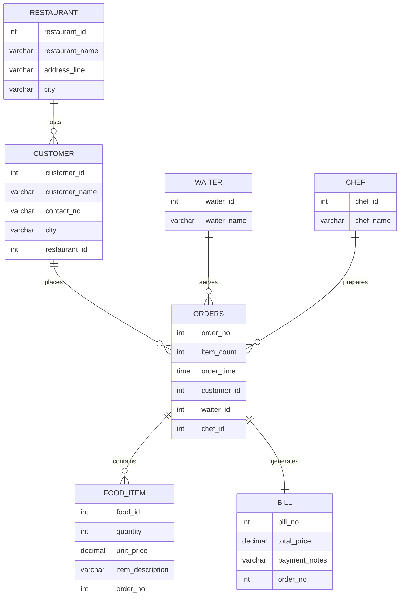

# Entity Relationship Diagram

```mermaid
erDiagram
    RESTAURANT ||--o{ CUSTOMER : hosts
    RESTAURANT {
        int restaurant_id
        varchar restaurant_name
        varchar address_line
        varchar city
    }

    CUSTOMER ||--o{ ORDERS : places
    CUSTOMER {
        int customer_id
        varchar customer_name
        varchar contact_no
        varchar city
        int restaurant_id
    }

    WAITER ||--o{ ORDERS : serves
    WAITER {
        int waiter_id
        varchar waiter_name
    }

    CHEF ||--o{ ORDERS : prepares
    CHEF {
        int chef_id
        varchar chef_name
    }

    ORDERS ||--o{ FOOD_ITEM : contains
    ORDERS {
        int order_no
        int item_count
        time order_time
        int customer_id
        int waiter_id
        int chef_id
    }

    ORDERS ||--|| BILL : generates
    BILL {
        int bill_no
        decimal total_price
        varchar payment_notes
        int order_no
    }

    FOOD_ITEM {
        int food_id
        int quantity
        decimal unit_price
        varchar item_description
        int order_no
    }
```
